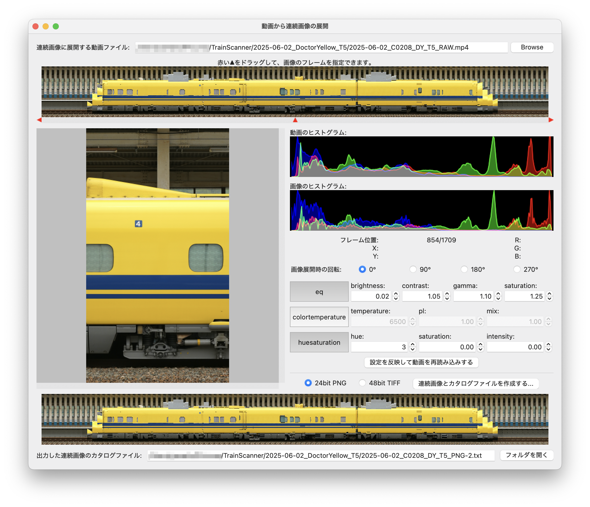
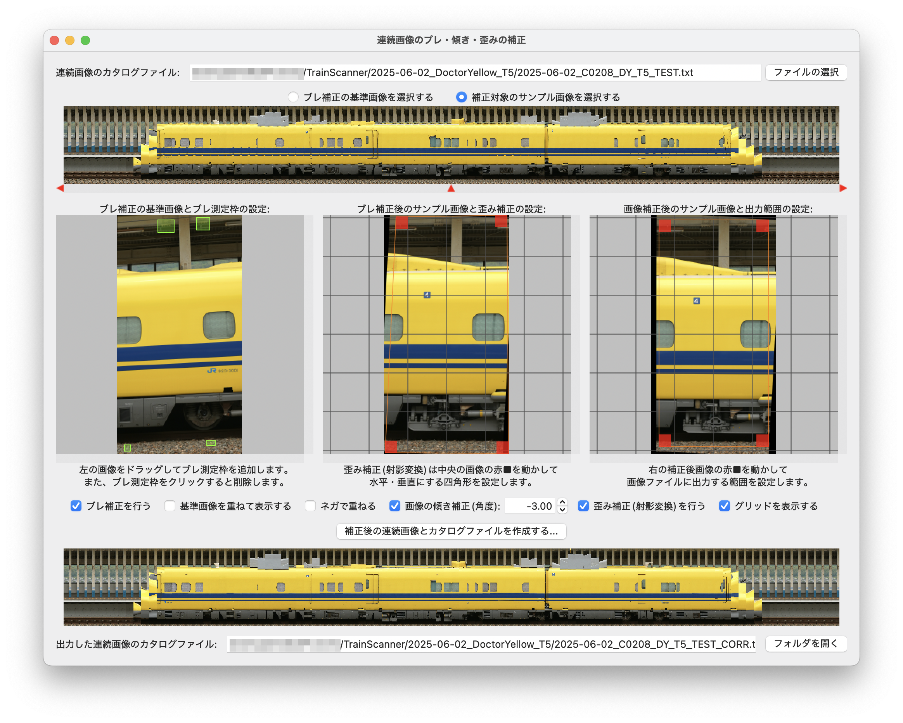

# tsutil

[TrainScanner](https://github.com/vitroid/TrainScanner)用の動画データを事前処理するためのツールです。また、TrainScannerで生成したステッチング画像をSNSなどで共有できるように動画変換するツールもあります。

<div style="white-space: nowrap; overflow-x: auto">
<a href="./docs/trimmer.md"><a href="./docs/trimmer.md"></a>
<a href="./docs/extractor.md"></a>
<a href="./docs/corrector.md"></a>
<a href="./docs/adjuster.md"></a>
<a href="./docs/converter.md"></a>
</div>

<div style="margin: 1em; text-align: center">

</div>

- [tsutil](#tsutil)
  - [特徴](#特徴)
  - [インストール](#インストール)
    - [Pythonのインストール](#pythonのインストール)
    - [ffmpegのインストール](#ffmpegのインストール)
      - [Windowsの場合](#windowsの場合)
      - [macOSの場合](#macosの場合)
      - [Linuxの場合](#linuxの場合)
    - [tsutilのインストール](#tsutilのインストール)
  - [起動](#起動)

## 特徴

- [動画ファイルのトリミング](./docs/trimmer.md): カメラで撮影した動画の不要な前後部分を無劣化で削除して、ディスク使用量を削減します。
- [動画ファイルから連続画像の展開](./docs/extractor.md): カメラで撮影した動画の各フレームを連続した画像ファイルに展開します。展開時に輝度や色の調整を行うことができます。
- [連続画像のブレ・傾き・歪みの補正](./docs/corrector.md): 手持ち撮影した動画から展開した連続画像ファイルのブレ、水平出し、歪み補正を行います。
- [ステッチング画像の縦横比の調整](./docs/adjuster.md): TrainScannerでステッチングした画像ファイルに対して、一両ずつ長さと高さを調整します。
- [ステッチング画像から動画に変換](./docs/converter.md): TrainScannerが生成するステッチング画像はとても大きいので、SNSに投稿できるように動画に変換します。
- ~~[ステッチング画像から動画に変換2](./docs/converter2.md): 拡大・縮小しながら表示位置が変わっていく複雑な動画を作成します。~~ (試作中)

## インストール

### Pythonのインストール

本プログラムはPython 3.12にて開発しています。Python 3.12以降をインストールしてください。

### ffmpegのインストール

本プログラムは[ffmpeg](https://ffmpeg.org)を使用します。ターミナル(コマンドプロンプトやシェル)でパッケージマネージャを使ってインストールしてください。インストール後、ターミナルで`ffmpeg`コマンドが実行できることを確認してください。

#### Windowsの場合

`winget`コマンドを使ってインストールできます。詳細は[こちらを参照](https://www.gyan.dev/ffmpeg/builds/)してください。

```powershell
winget install ffmpeg
```

#### macOSの場合

[Homebrew](https://brew.sh)でインストールできることを確認しています。

```bash
brew install ffmpeg
```

#### Linuxの場合

Ubuntuの場合は`apt`でインストールできます。

```bash
sudo apt install ffmpeg
```

### tsutilのインストール

ターミナルで`pip3`コマンドを使ってインストールします。Pythonの仮想環境([venv](https://docs.python.org/ja/3.13/library/venv.html))を作ってTrainScannerといっしょにインストールしておくと良いでしょう。

```bash
pip3 install git+https://github.com/yamakox/tsutil.git
```

## 起動

ターミナルで以下のコマンドを入力すると、メイン画面が開きます。

```bash
tsutil
```
