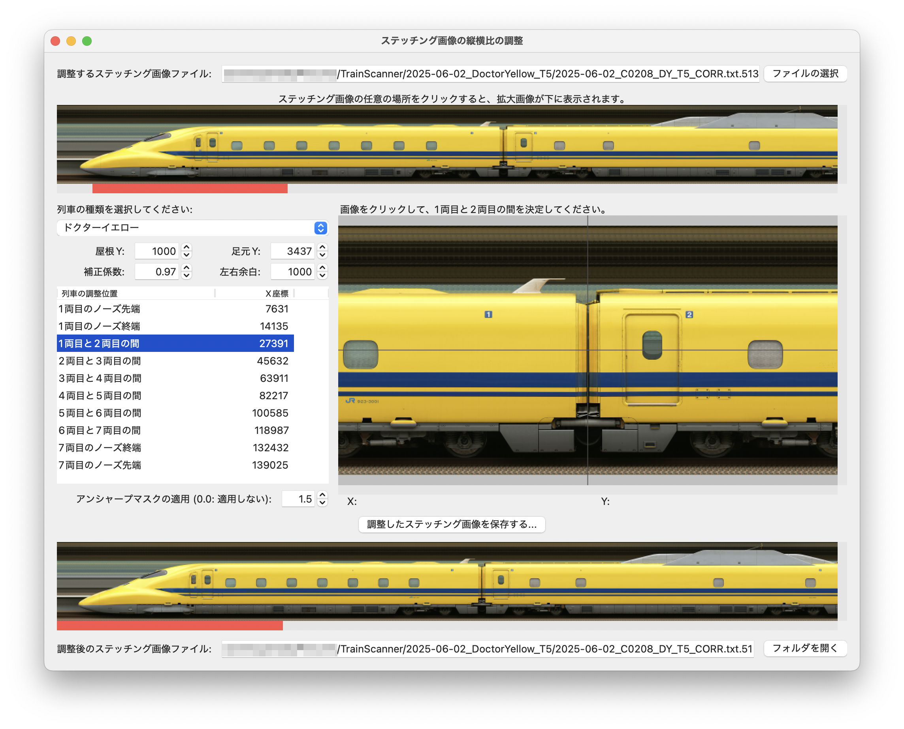
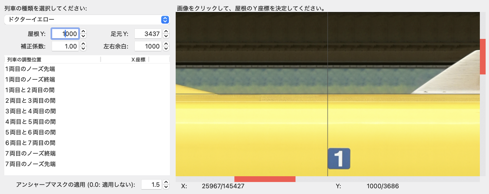
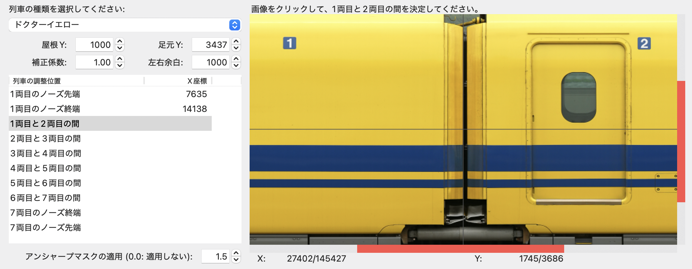

# ステッチング画像の縦横比の調整

TrainScannerでつなぎ合わせた(ステッチングした)画像ファイルに対して、一両ずつ長さと高さを調整します。なお、車両のデータは作成中です。(最初のバージョンでは`700系E編成`と`ドクターイエロー`だけ)

## 使い方

- `調整するステッチング画像ファイル`の右端にある`Browse`ボタン(あるいは`ファイルの選択`)を押して、TrainScannerが生成した画像ファイルを選択します。
- 一段目にはステッチング画像のプレビューが表示されます。プレビューをクリックすると、二段目右に拡大画像が表示されます。
- `列車の種類を選択してください`で列車の種類を選びます。`列車の調整位置`リストには、1両ごとに長さを調整する場所の一覧が表示されます。新幹線の場合、ノーズの長さが伸びたり縮んだりすることがあるため、ノーズの終端位置も入力するようにしています。
- `屋根Y`と`足元Y`は列車の高さを決めるために縦方向(Y軸方向・下向きが正)の座標を入力します。`屋根Y`または`足元Y`をクリックしてから右の画像の屋根または足元の位置をクリックするとそのY座標が入力されます。

- `列車の調整位置`は列車の幅を決めるために横方向(X軸方向・右向きが正)の座標を入力します。`列車の調整位置`リストの項目をクリックしてから右の画像の該当位置をクリックするとそのX座標が入力されます。

- 縦横比を調整したステッチング画像を保存した後、Photoshopなどで画像を見たときに縦方向が伸びたり縮んだりしているようなら`補正係数`を変えてみてください。
  - 高さを95%に縮小するのであれば、`補正係数`を`0.95`とします。
  - 高さを105%に拡大するのであれば、`補正係数`を`1.05`とします。
- `左右余白`は列車の先端(左端と右端)に入れる余白のピクセル幅を入力します。
- `アンシャープマスクの適用`には縦横比を調整した後の画像をシャープにするための数値を入力します。大きい数値ほどシャープになります。`0.0`を入れるとアンシャープマスクの処理は行いません。
- `調整したステッチング画像を保存する`ボタンを押して保存先の画像ファイル名を入力すると、車両の縦横比を調整した画像を生成します。
