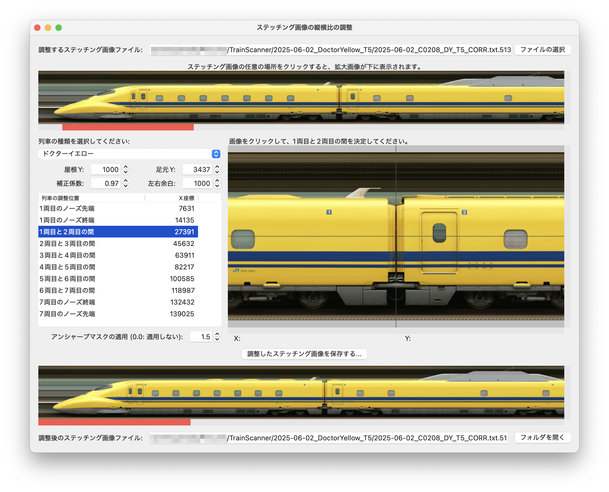
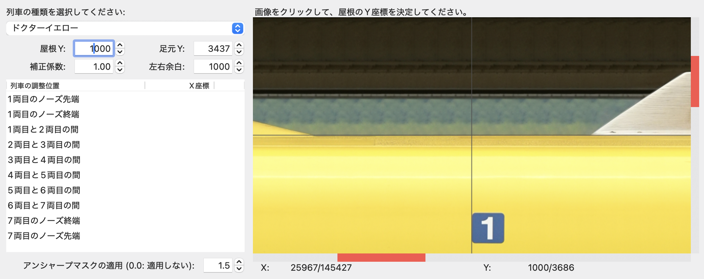
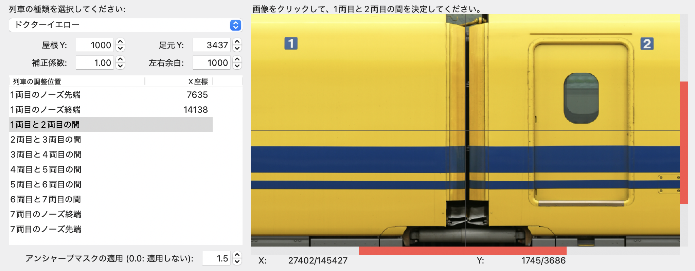
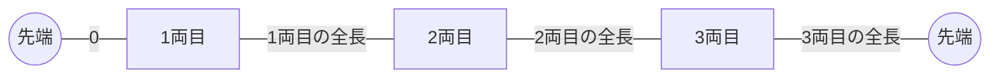

# ステッチング画像の縦横比の調整

TrainScannerでつなぎ合わせた(ステッチングした)画像ファイルに対して、一両ずつ長さと高さを調整します。なお、車両のデータは作成中です。



## 使い方

- `調整するステッチング画像ファイル`の右端にある`Browse`ボタン(あるいは`ファイルの選択`)を押して、TrainScannerが生成した画像ファイルを選択します。
- 一段目にはステッチング画像のプレビューが表示されます。プレビューをクリックすると、二段目右に拡大画像が表示されます。
- `列車の種類を選択してください`で列車の種類を選びます。`列車の調整位置`リストには、1両ごとに長さを調整する場所の一覧が表示されます。新幹線の場合、ノーズの長さが伸びたり縮んだりすることがあるため、ノーズの終端位置も入力するようにしています。
- `屋根Y`と`足元Y`は列車の高さを決めるために縦方向(Y軸方向・下向きが正)の座標を入力します。`屋根Y`または`足元Y`をクリックしてから右の画像の屋根または足元の位置をクリックするとそのY座標が入力されます。



- `列車の調整位置`は列車の幅を決めるために横方向(X軸方向・右向きが正)の座標を入力します。`列車の調整位置`リストの項目をクリックしてから右の画像の該当位置をクリックするとそのX座標が入力されます。



- 縦横比を調整したステッチング画像を保存した後、Photoshopなどで画像を見たときに縦方向が伸びたり縮んだりしているようなら`補正係数`を変えてみてください。
  - 高さを95%に縮小するのであれば、`補正係数`を`0.95`とします。
  - 高さを105%に拡大するのであれば、`補正係数`を`1.05`とします。
- `左右余白`は列車の先端(左端と右端)に入れる余白のピクセル幅を入力します。
- `アンシャープマスクの適用`には縦横比を調整した後の画像をシャープにするための数値を入力します。大きい数値ほどシャープになります。`0.0`を入れるとアンシャープマスクの処理は行いません。
- `調整したステッチング画像を保存する`ボタンを押して保存先の画像ファイル名を入力すると、車両の縦横比を調整した画像を生成します。

## 車両データの作成

tsutil起動時のカレントディレクトリに`adjuster.json`というファイルを作成すると、追加の車両データを読み込むことができます。正常に読み込めた場合、`列車の種類を選択してください`のリストで追加車両名を選択できるようになります。

```adjuster.json
{
    "dataset": {
        "瑞風": {
            "height":4070,
            "factor":1.0,
            "positions": [
                {"length":0, "description":"1両目のノーズ先端", "coupler":false},
                {"length":21600, "description":"1両目と2両目の間", "coupler":true},
                {"length":20800, "description":"2両目と3両目の間", "coupler":true},
                {"length":20800,"description":"3両目と4両目の間","coupler":true},
                {"length":20800,"description":"4両目と5両目の間","coupler":true},
                {"length":20800,"description":"5両目と6両目の間","coupler":true},
                {"length":20800,"description":"6両目と7両目の間","coupler":true},
                {"length":20800,"description":"7両目と8両目の間","coupler":true},
                {"length":20800,"description":"8両目と9両目の間","coupler":true},
                {"length":20800,"description":"9両目と10両目の間","coupler":true},
                {"length":21600,"description":"10両目のノーズ先端","coupler":false}
            ]
        }
    }
}
```

`adjuster.json`の各キーは以下のようになっています。

- `dataset`: `adjuster.json`のルート要素
  
  キーには列車名を、値には寸法情報を格納したオブジェクトを指定します。上記の例では`"瑞風"`がキーで、`:`以降の`{ ... }`が瑞風の寸法情報を格納したオブジェクトになります。

- `height`: 車両の全高。単位: mm

- `factor`: 車両の全高にかける補正係数

  調整後の画像が縦長になる場合、`factor`を`1.0`より小さくすると縦方向を短くします。また、調整後の画像が横長になる場合、`factor`を`1.0`より大きくして縦方向を伸ばします。

- `positions`: 列車の長さの寸法データ。

  `[`から`]`までの間に、`{"length": 全長, "description": "場所の説明", "coupler": 連結位置フラグ}`を`,`区切りで格納します。

- `length`: 1つ前の位置からの長さ。1つ目は常に`0`である。単位: mm
- `description`: `ノーズ先端`や`x両目とy両目の間`など、位置の説明文章。
- `coupler`: 1両ごとの区切り位置であることを示すフラグ。車両と車両の連結位置の場合`True`、ノーズ先端やノーズ末尾などの位置を表す場合`False`を指定する。


`positions`には、列車の左側のノーズ先端から列車の右側のノーズ先端までの位置を格納します。列車の左側ノーズ先端が位置の基準(`0`)になり、ノーズの長さや車両の長さに基づいて、列車の右側ノーズ先端までの位置を決めていきます。

各位置は、1つ前の位置からの長さ(相対位置)で登録します。例えば1両ごとに位置を決めていくのであれば、1つ目の位置は`0`、1両目と2両目の間は`1両目の全長`、2両目と3両目の間は`2両目の全長`、...となります。


```mermaid
flowchart LR
  a((先端)) ---|0|1両目 ---|1両目の全長|2両目 ---|2両目の全長|3両目 ---|3両目の全長|b((先端))
```
