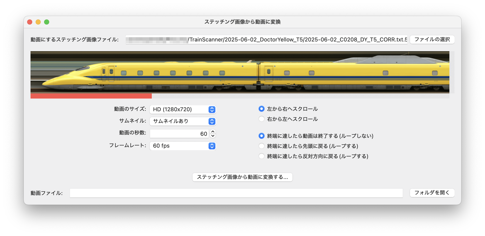

# ステッチング画像から動画に変換

TrainScannerが生成するステッチング画像はとても大きいので、WebやSNSで共有できるように動画に変換します。

## 使い方

- `動画にするステッチング画像ファイル`の右端にある`Browse`ボタン(あるいは`ファイルの選択`)を押して、TrainScannerが生成した画像ファイルを選択します。
- `動画のサイズ`で出力する動画のサイズを選びます。
- `サムネイル`は動画の上にステッチング画像のサムネイルを表示するかしないかを選びます。長い編成の列車ではサムネイルが小さくなってしまうので、`高さを◯倍にする`を選ぶと縦方向が伸びたサムネイルを作ります。
- `動画の秒数`で再生時間を入力します。
- `フレームレート`で1秒間のフレーム数(コマ数)を選びます。
- スクロール方向やループについては以下のXのポストを参考にしてください。
- `ステッチング画像から動画に変換する`ボタンを押して保存先の動画ファイル名を入力すると、動画ファイルを生成します。`フォルダを開く`ボタンを押すと、動画ファイルの入ったフォルダーが開きます。

<blockquote class="twitter-tweet" data-media-max-width="560">
TrainScannerで生成した画像をSNSなどで共有しやすいように動画に変換するツールもGUI化。 ついでにループ再生用動画も真面目に実装しました。これはちゃんとループできるか確認用のポスト。 <a href="https://t.co/Ol99YYo3Fw">pic.twitter.com/Ol99YYo3Fw</a>
&mdash; yamako α® (@yamakox) <a href="https://twitter.com/yamakox/status/1938180624663384370?ref_src=twsrc%5Etfw">June 26, 2025</a></blockquote> 
