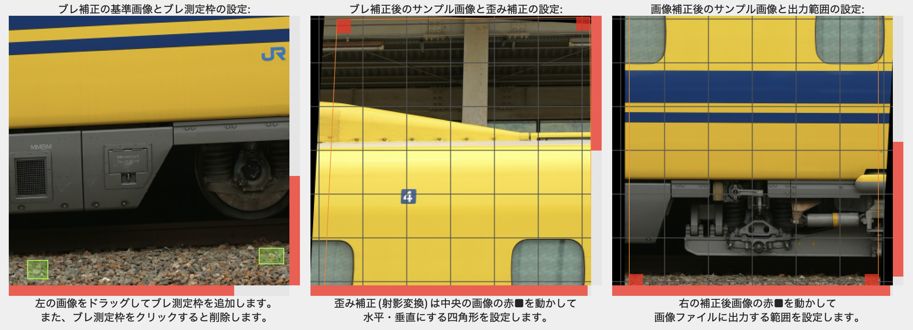
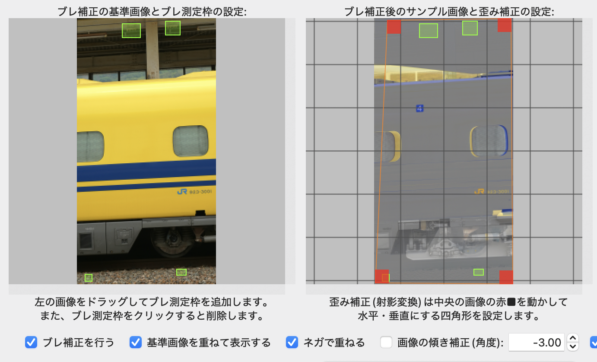

# 連続画像のブレ・傾き・歪みの補正

手持ち撮影した動画から展開した連続画像ファイルのブレ、水平出し、歪み補正を行います。

なお、ここでいう`ブレ`とは手振れや強風などで発生した振動などにより動画の各フレームで`位置ずれ`が起きている状態のことで、TrainScannerでつなぎ合わせたときにガタガタにならないよう位置補正を行います。流し撮りのように像が流れている画像を補正するものではありません。

## 使い方

- `連続画像のカタログファイル`の右端にある`Browse`ボタン(あるいは`ファイルの選択`)を押して、連続画像のカタログファイル(拡張子は`.txt`)を選択します。
- `ブレ補正の基準画像を選択する`を選択して連続画像プレビューの下にある赤い▲を左右にドラッグすると、左側のプレビューに基準画像が表示されます。基準画像はブレている他の画像の位置合わせに使われます。
- `補正対象のサンプル画像を選択する`を選択して連続画像プレビューの下にある赤い▲を左右にドラッグすると、中央と右側のプレビューにサンプル画像が表示されます。
- プレビューはピンチイン・ピンチアウト(macOSで動作確認済)、またはマウスホイールを使って拡大表示できます。なお、右と下の赤いバーはスクロールバーです。

- 左側のプレビューをドラッグして緑色のブレ測定枠を追加できます。ブレ測定枠をクリックすると削除できます。線路のバラストや建物など、背景で明暗が分かりやすい部分を選択してください。
- 中央のプレビューには、基準画像に基づいてブレ補正を行ったサンプル画像が表示されます。`基準画像を重ねて表示する`をオンにすると、基準画像とサンプル画像が重なって表示されます。`ネガで重ねる`をオンにすると、基準画像の明暗を反転します。サンプル画像のずれている部分は像が二重になるため、ブレ補正がうまくできているかどうか確認しやすいと思います。

- ブレ補正した画像が傾いているときは`画像の傾き補正(角度)`を入力して傾きを補正してください。プラスで反時計回り、マイナスで時計回りになります。
- 列車が台形のように歪んでいるときは、中央のプレビュー四隅にある赤い■を動かして、歪みを水平・垂直に補正することができます。
- 右端のプレビューには中央のプレビューで設定した歪み補正後のサンプル画像が表示されます。四隅にある赤い■を動かして補正画像ファイルに出力する範囲を設定できます。
- `補正後の連続画像とカタログファイルを作成する`ボタンを押してカタログファイル名を入力すると、補正した連続画像とカタログファイルを作成します。
- なお、入力した設定値は`カタログファイル名.correct.json`というファイルに保存されます。
