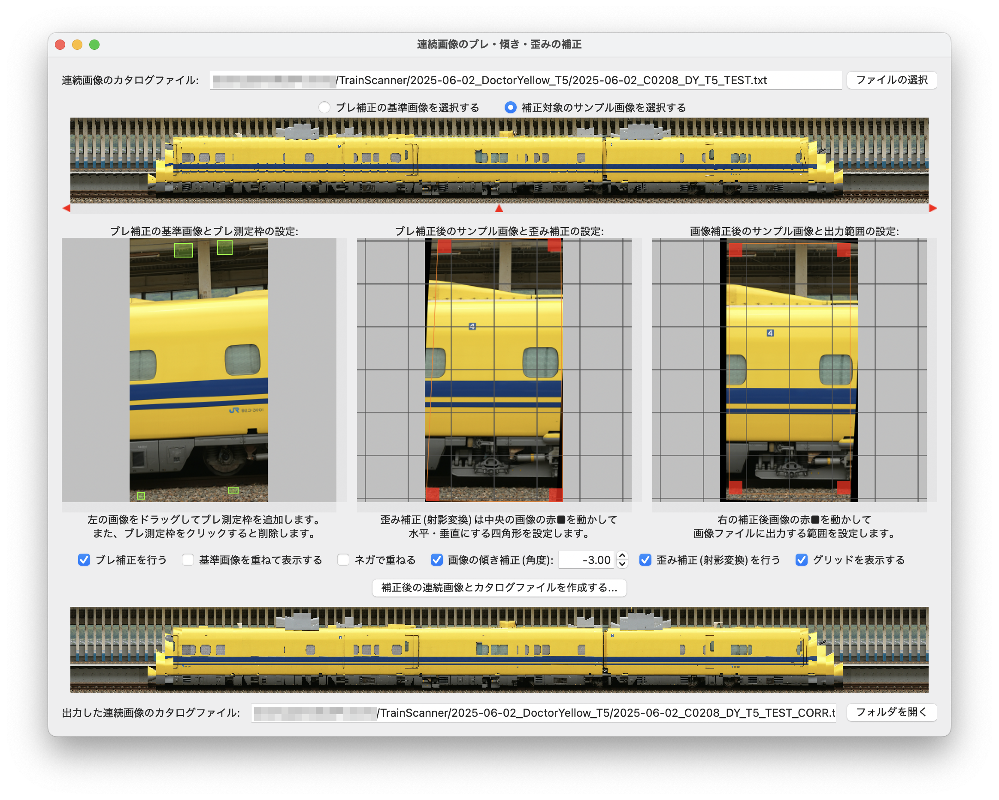
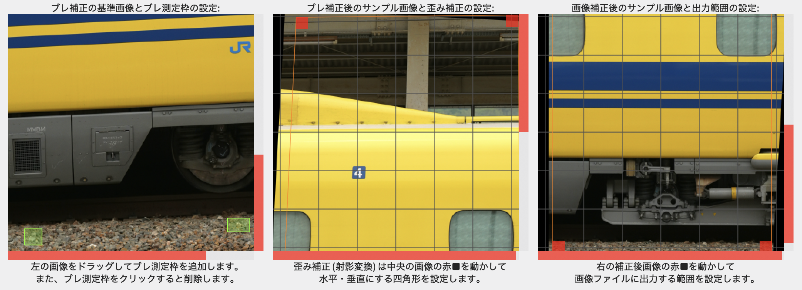
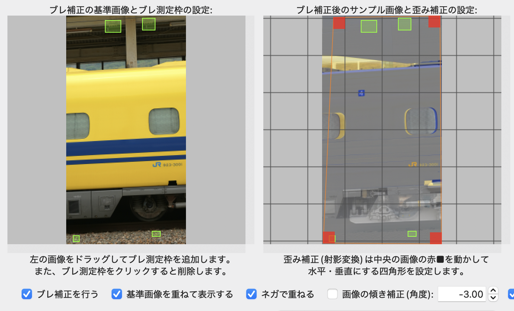
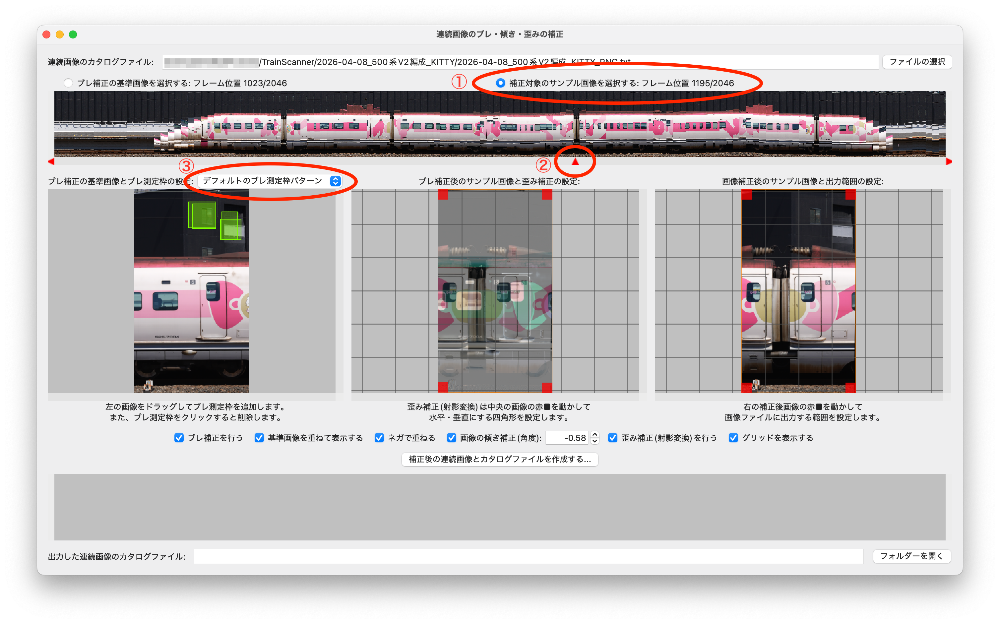
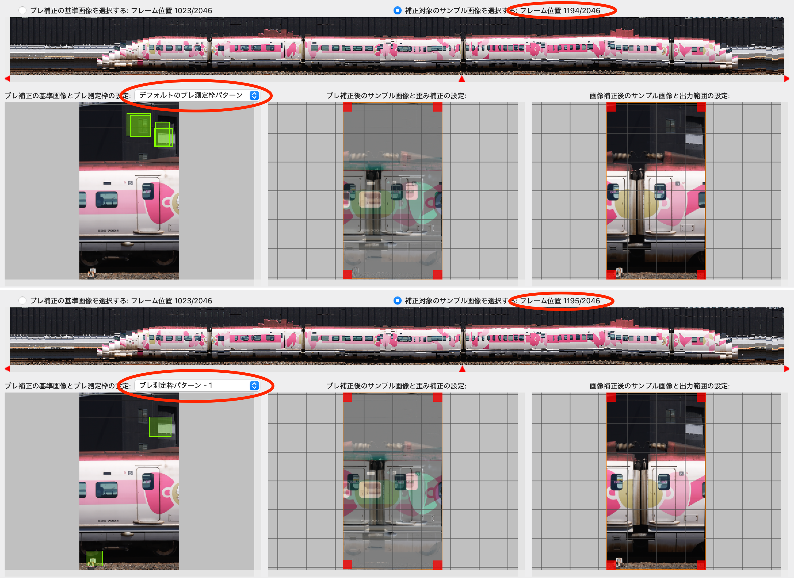
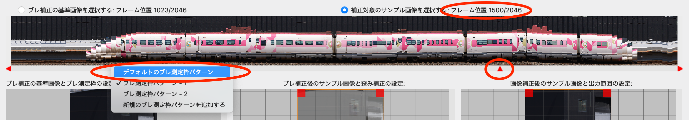

# 連続画像のブレ・傾き・歪みの補正

手持ち撮影した動画から展開した連続画像ファイルのブレ、水平出し、歪み補正を行います。

なお、ここでいう`ブレ`とは手振れや強風などで発生した振動などにより動画の各フレームで`位置ずれ`が起きている状態のことで、TrainScannerでつなぎ合わせたときにガタガタにならないよう位置補正を行います。流し撮りのように像が流れている画像を補正するものではありません。

## 使い方

- `連続画像のカタログファイル`の右端にある`Browse`ボタン(あるいは`ファイルの選択`)を押して、連続画像のカタログファイル(拡張子は`.txt`)を選択します。
- `ブレ補正の基準画像を選択する`を選択して連続画像プレビューの下にある赤い▲を左右にドラッグすると、左側のプレビューに基準画像が表示されます。基準画像はブレている他の画像の位置合わせに使われます。
- `補正対象のサンプル画像を選択する`を選択して連続画像プレビューの下にある赤い▲を左右にドラッグすると、中央と右側のプレビューにサンプル画像が表示されます。
- プレビューはピンチアウト・ピンチイン(MacBook Proで動作確認済)、またはCtrlキーを押しながらマウスホイールを回して拡大・縮小できます。なお、右と下の赤いバーはスクロールバーです。

- 左側のプレビューをドラッグして緑色のブレ測定枠を追加できます。ブレ測定枠をクリックすると削除できます。線路のバラストや建物など、背景で明暗が分かりやすい部分を選択してください。
  - `ブレ測定枠パターン`については、[ブレ測定枠パターンの使い方](#ブレ測定枠パターンの使い方)で説明します。
- 中央のプレビューには、基準画像に基づいてブレ補正を行ったサンプル画像が表示されます。`基準画像を重ねて表示する`をオンにすると、基準画像とサンプル画像が重なって表示されます。`ネガで重ねる`をオンにすると、基準画像の明暗を反転します。サンプル画像のずれている部分は像が二重になるため、ブレ補正がうまくできているかどうか確認しやすいと思います。

- ブレ補正した画像が傾いているときは`画像の傾き補正(角度)`を入力して傾きを補正してください。プラスで反時計回り、マイナスで時計回りになります。
- 列車が台形のように歪んでいるときは、中央のプレビュー四隅にある赤い■を動かして、歪みを水平・垂直に補正することができます。
- 右端のプレビューには中央のプレビューで設定した歪み補正後のサンプル画像が表示されます。四隅にある赤い■を動かして補正画像ファイルに出力する範囲を設定できます。
- `補正後の連続画像とカタログファイルを作成する`ボタンを押してカタログファイル名を入力すると、補正した連続画像とカタログファイルを作成します。
- なお、入力した設定値は`カタログファイル名.correct.json`というファイルに保存されます。

## ブレ測定枠パターンの使い方

手持ち撮影の手ブレが激しい場合、1パターンのブレ測定枠では補正しきれないことがありました。そこで、複数パターンのブレ測定枠を設定できる機能を追加しています。

- ①を選択して、補正対象のサンプル画像を選択するモードにしてください。
- ②でブレ補正しきれないサンプル画像のフレームを選択します。
- ③のメニューで`新規のブレ測定枠パターンを追加する`を選択すると、`ブレ測定枠パターン - 1`が作成され、左側のプレビューのブレ測定枠がリセットされますので、新たにブレ測定枠を追加してください。

ブレ測定枠のパターンは、③のメニューで`新規のブレ測定枠パターンを追加する`を選択したときのサンプル画像のフレーム位置(①かつ②の位置)で記憶します。②のフレーム位置とその**右側**は、追加したブレ測定枠パターンが適用されます。

例えば、全体で`2046`個のフレームに対して、`1195`フレーム目のサンプル画像の位置で`新規のブレ測定枠パターンを追加する`を選択すると`ブレ測定枠パターン - 1`が作成され、以下のようにブレ測定枠パターンが適用されます。

- `0〜1194`のフレーム位置では、`デフォルトのブレ測定枠パターン`が適用される
- `1195〜2045`のフレーム位置では、`ブレ測定枠パターン - 1`が適用される

ブレ測定枠のパターンは、`新規のブレ測定枠パターンを追加する`を選択するか、あるいは既存のブレ測定枠のパターンを③のメニューで選択すると、現在のサンプル画像のフレーム位置で記憶します。

例えば、`1195`フレーム目で`ブレ測定枠パターン - 1`を作成した後、`800`フレーム目に`ブレ測定枠パターン - 2`を作成し、さらに`1500`フレーム目で`デフォルトのブレ測定枠パターン`を選択すると、以下のようにブレ測定枠パターンが適用されます。

- `0〜799`のフレーム位置では、`デフォルトのブレ測定枠パターン`が適用される
- `800〜1194`のフレーム位置では、`ブレ測定枠パターン - 2`が適用される
- `1195〜1499`のフレーム位置では、`ブレ測定枠パターン - 1`が適用される
- `1500〜2045`のフレーム位置では、`デフォルトのブレ測定枠パターン`が適用される

なお、ブレ測定枠パターンはサンプル画像のフレーム位置と測定枠のセットで記憶しますが、基準画像のフレーム位置はその中に含まれません。基準画像のフレーム位置は全体で共通になります。ブレ測定枠パターンを追加した後に基準画像のフレーム位置を変更すると、元からあったブレ測定枠パターンでは基準画像が変わったことでうまく補正できなくなる可能性があります。
