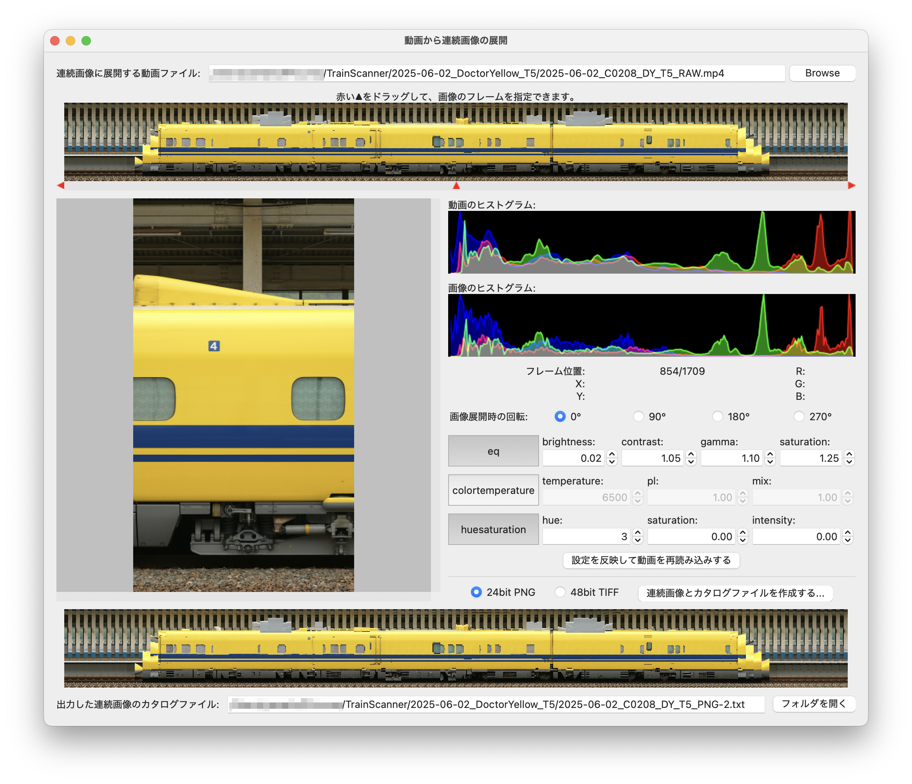

# 動画から連続画像の展開

カメラで撮影した動画の各フレームを連続した画像ファイルに展開します。展開時に輝度や色の調整を行うことができます。



## 使い方

- `連続画像に展開する動画ファイル`の右端にある`Browse`ボタン(あるいは`ファイルの選択`)を押して、動画ファイルを選択します。
- 動画のプレビューの下にある赤い▲を左右にドラッグすると、その再生位置での動画のフレームを画像表示します。
- カメラの機種によっては縦に設置して撮影すると動画が横になっている場合があるので、`画像展開時の回転`で`90°`または`270°`を選択してください。
- `eq`、`colortemperature`、`huesaturation`はffmpegの[-vf (-filter:v)](https://ffmpeg.org/ffmpeg-all.html#Video-Options)や[-filter_complex](https://ffmpeg.org/ffmpeg-all.html#toc-Advanced-options)オプションで指定するフィルターです。詳細は[FFmpeg Filters Documentation](https://ffmpeg.org/ffmpeg-filters.html)を参照してください。
  - [eq](https://ffmpeg.org/ffmpeg-filters.html#eq)
  - [colortemperature](https://ffmpeg.org/ffmpeg-filters.html#colortemperature)
  - [huesaturation](https://ffmpeg.org/ffmpeg-filters.html#huesaturation)
- `設定を反映して動画を再読み込みする`ボタンを押すと、画像の回転やffmpegのフィルターを適用して動画ファイルを再読み込みします。
- `連続画像とカタログファイルを作成する`ボタンを押してカタログファイル名を入力すると、動画ファイルから連続画像(`24bit PNG`形式または`48bit TIFF`形式)とカタログファイルを作成します。YUV 4:2:2 10bitのような形式の動画データのために48bit TIFFでも出力できるようにしています。Photoshopなどで画像処理する場合にご利用ください。
- なお、本画面に入力した設定値は`動画ファイル名.extract.json`というファイルに保存されます。

## 補足

### カタログファイル

- カタログファイルは拡張子が`.txt`のファイルで保存されます。カタログファイルの保存先フォルダー(ディレクトリ)にはカタログファイル名と同名のフォルダーが作成され、その中に画像ファイルが連番で保存されます。例えばカタログファイル名が`Shinkansen.txt`の場合、`Shinkansen`フォルダーに連番の画像ファイルが保存されます。
- `f00001.png`、`f00002.png`などの画像ファイル名は固定です。動画の先頭からフレームを取り出した順に、1から始まる番号を付けて画像ファイルに保存しています。

```bash
.
├── Shinkansen.txt
└── Shinkansen
    ├── f00001.png
    ├── f00002.png
    ├── f00003.png
    ├── f00004.png
    :
```

- カタログファイルの中には画像ファイル名の一覧が格納されます。

```Shinkansen.txt
Shinkansen/f00001.png
Shinkansen/f00002.png
Shinkansen/f00003.png
Shinkansen/f00004.png
:
```

- [`連続画像のブレ・傾き・歪みの補正`](./docs/corrector.md)ではカタログファイルの先頭行から順に画像ファイルを読み込みます。このため、カタログファイルをテキスト編集して以下のようなことができます。
  - 画像ファイルの順番を逆転して反対方向から処理を行う
  - 前半・後半・途中など、画像ファイルの範囲を絞り込んで処理を行う
  - 偶数番号・奇数番号の画像ファイル名だけにして、データを間引く

```Shinkansen.txt
Shinkansen/f00001.png
Shinkansen/f00003.png
Shinkansen/f00005.png
Shinkansen/f00007.png
:
```

- なお、最新(2025年6月末)のTrainScannerでは連番の画像ファイルの入ったフォルダーをドラッグ&ドロップして開くことができるようになっています。(カタログファイルには未対応)
- (少し古いですが)TrainScanner 0.13.2を元に、カタログファイルの読み込みに対応した改造版TrainScannerもあります。以下のコマンドでインストールできます。

```bash
pip3 install git+https://github.com/yamakox/TrainScanner.git@image-catalog-file-0.13.2
```

### 余談

- 本プログラムを作るまでは、動画から画像に展開してブレ補正などを行った後に再び動画に再エンコードしてTrainScannerに渡していたのですが、動画にエンコードするときに色化けが発生することがあったため(参考: [Colorspace support in FFmpeg](https://trac.ffmpeg.org/wiki/colorspace#colorspace_yuv420p))、展開した画像ファイルをそのまま読み込めるようにTrainScannerを改造しました。
