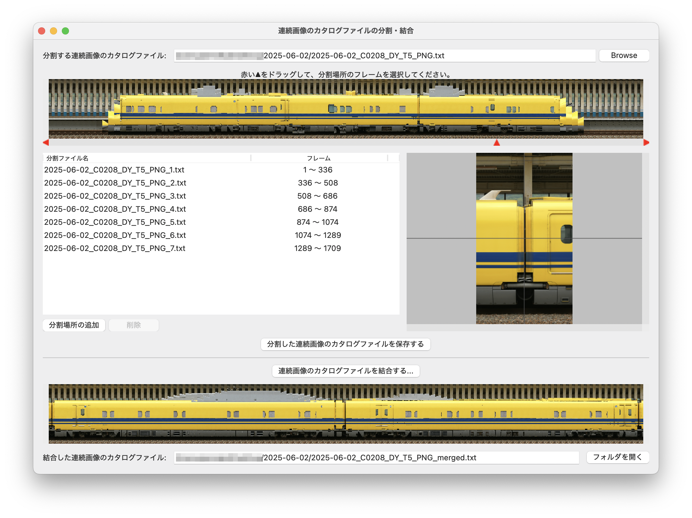

# 連続画像のカタログファイルの分割・結合

撮影中の手ブレの振れ幅が大きいと、1編成のブレ補正がうまくできないことがありました。この場合、連続画像を1両ずつ分割してやることで手ブレの振れ幅が小さくなり、ブレ補正処理がうまくできるようになりました。

このツールは連続した画像のカタログファイルを分割して、ブレ補正などの画像処理をやりやすくします。

## 使い方

### 連続画像のカタログファイルの分割

- `分割する連続画像のカタログファイル`の右端にある`Browse`ボタン(あるいは`ファイルの選択`)を押して、連続画像のカタログファイル(拡張子は`.txt`)を選択します。
- 連続画像プレビューの下にある赤い▲を左右にドラッグすると、右下にその位置の画像が表示されます。
- `分割場所の追加`ボタンを押すとカタログファイルの分割位置が追加され、`分割ファイル名`には分割後のファイル一覧が表示されます。`フレーム`には分割後のカタログファイルに格納されるフレームの範囲が表示されます。
- 分割ファイル名の行を選択して`削除`ボタンを押すとカタログファイルの分割位置が削除されます。なお、1行目は削除できません。
- `分割した連続画像のカタログファイルを保存する`ボタンを押すと分割されたカタログファイルが生成されます。保存先はオリジナルと同じフォルダーになります。

### 分割後のカタログファイルの使用

- 分割した連続画像のカタログファイルは[`連続画像のブレ・傾き・歪みの補正`](./docs/corrector.md)で画像補正することができます。
- 分割した連続画像ごとにブレ補正や回転補正などを行うと、互いにブレ補正の位置がずれたり回転補正の角度が微妙にずれたりします。そこで、カタログファイルを結合して単一の連続画像のカタログファイルを作成し、[`連続画像のブレ・傾き・歪みの補正`](./docs/corrector.md)を使って全体のずれを補正してください。

### 連続画像のカタログファイルの結合

- `連続画像のカタログファイルを結合する`ボタンを押すとカタログファイルの選択画面が表示されます。結合するカタログファイルを2つ以上選択してください。
- 続けてファイル保存の画面が表示されます。結合した連続画像のカタログファイル名を入力して保存してください。結合したカタログファイルのプレビューが表示されます。なお、ファイル名を昇順で並べ替えてから結合を行います。
