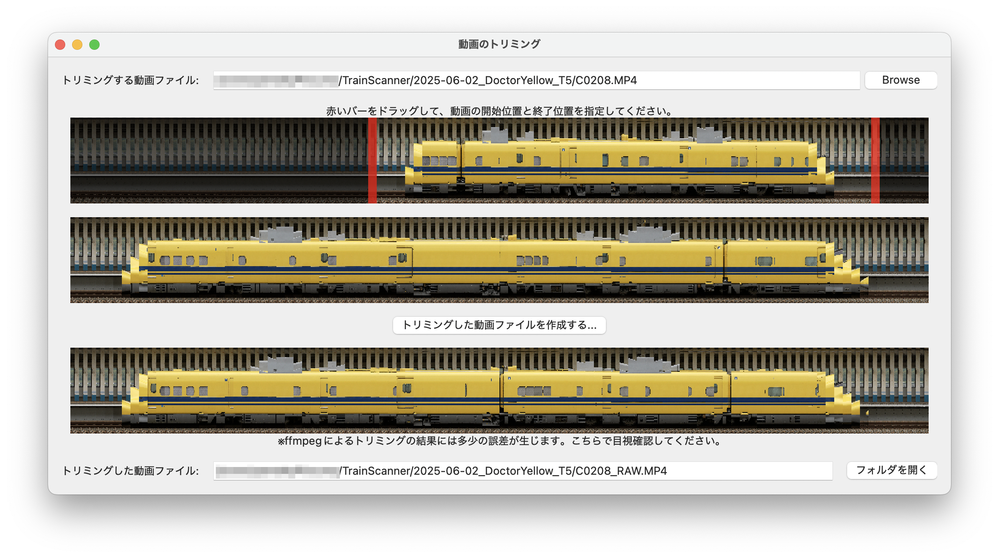

# 動画のトリミング

カメラで撮影した動画の不要な前後部分を無劣化で削除して、生データを保管するディスクの使用量を削減します。



## 使い方

- `トリミングする動画ファイル`の右端にある`Browse`ボタン(あるいは`ファイルの選択`)を押して、カメラからコピーした動画ファイルを選択します。
- 1段目の左右にある赤いバーをドラッグして、動画の開始位置と終了位置を指定します。2段目にはトリミング後の動画の範囲が表示されます。
- `トリミングした動画ファイルを作成する`ボタンを押すとファイル保存ダイアログが表示されます。ファイル名を入力して保存すると、3段目にトリミング後の動画ファイルのプレビューが表示されます。

## 補足

動画のトリミングには`ffmpeg`を使っています。`-c copy`パラメータを用いることにより、[動画のデコード・エンコードなし](https://ffmpeg.org/ffmpeg-all.html#Streamcopy)で指定範囲の動画をコピーします。

```bash
ffmpeg -loglevel error -ss <開始位置> -to <終了位置> -i <入力ファイル名> -c copy -y <出力ファイル名>
```
